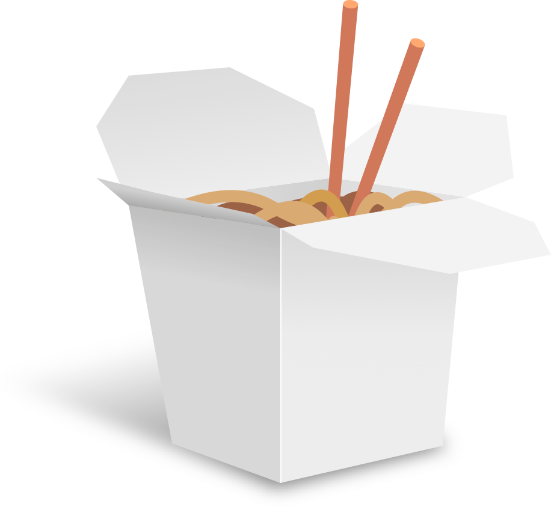

<p align="center">
  
</p>


# Soba
Soba is a **work in progress** permissively licensed cross platform UI toolkit for D. The toolkit targets productivity apps which benefit from real-time rendering capabilities.

Soba is mainly designed after the needs of the Inochi2D project, as such any feature requests that don't neatly fit in to our needs may take a while to be implemented.

## What to expect
Soba aims to support writing individual applications for Windows, macOS, Linux (and the BSDs that support Vulkan).  
With a design combining the sensibilities of retained UI and immediate UI Soba aims to work well with multimedia applications.

Soba is however only made for application development, it is not suitable for things such as creating desktop environments.

## Why the name "Soba"?

libsoba spawned from an earlier project I worked on while working on Glimpse Image Editor. 

## How do I open a Window?

**NOTE** libsoba is not ready for mainstream use and basically nothing works yet lol

1. Call sbInit to initialize libsoba
2. Create a SbApp with information about your app
3. Call SbApp.run with a SbApplicationWindow as a parameter.

```d
module app;
import soba;
import soba.core.gpu;
import soba.ui.window.appwindow;
import soba.drawing;

class MyApplication : SbApplicationWindow {
public:
    this(SbApp app) {
        super(app, 640, 480);
    }

    /**
        Called when the application should be re-rendered.
    */
    override
    void onRender(SbDrawingContext drawing) {
        // TODO: draw stuff
    }
}

int main() {
    sbInit();

    SbAppInfo info;
    info.name = nstring("My Cool App");
    info.version_ = nstring("1.0.0");

    SbApplication app = nogc_new!SbApplication(info);
    return app.run(nogc_new!MyApplication(app, 640, 480));
}
```